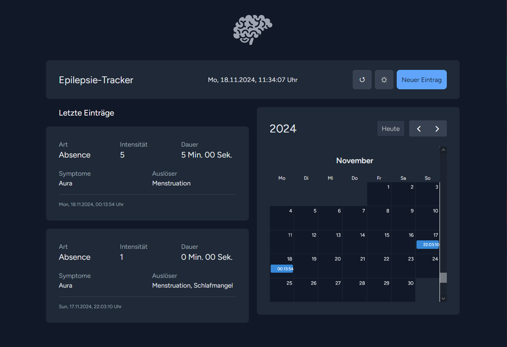

[](https://github.com/FloKnapp/laravel-11/actions/workflows/laravel.yml)

# About this project

This application let epilepsy patients track their episodes.



# Requirements

- Git
- Docker

#### Services being used in Docker

- PHP 8.3
- MariaDB 11
- Mailpit (optional)
- Redis (optional)

# Installation

Clone this repository. Example:
```bash
git clone git@github.com:FloKnapp/laravel-11.git
```

Run the following commands from the root directory of the application (this could take a while):

```bash
$> ./vendor/bin/sail up -d 
```

### Execute Migrations

```bash
$> ./vendor/bin/sail artisan migrate
```

### Activate Watcher

Start the vite bundler and file watcher:

```bash
$> ./vendor/bin/sail npm run dev
```

# Run Tests

```bash
$> ./vendor/bin/sail test
```
